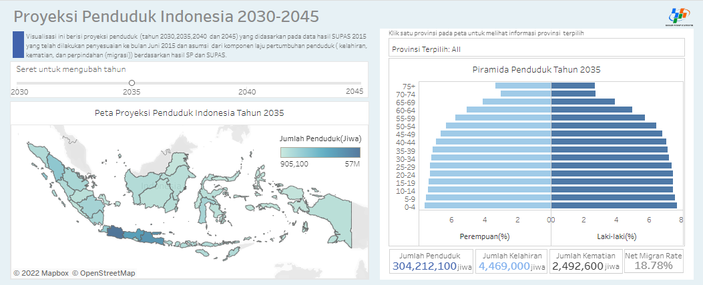

<!-- ABOUT THE PROJECT -->
# Visualisasi Data Interaktif Proyeksi Penduduk Indonesia 
## Gambaran Umum Project

Visualisasi data interaktif yang dibangun akan menampilkan proyeksi penduduk tahun 2030,2035,2040 dan 2045 yang didasarkan pada data hasil SUPAS 2015 yang telah dilakukan penyesuaian ke bulan Juni 2015 dan asumsi dari komponen laju pertumbuhan penduduk (kelahiran, kematian, dan perpindahan (migrasi)) berdasarkan hasil SP dan SUPAS yang dilakukan Badan Pusat Statistik (BPS).

### Tujuan
Diharapkan, visualisasi data interaktif yang dibangun ini dapat memberikan informasi kepada pemerintah pusat maupun pemerintah provinsi sehingga dapat dijadikan acuan dalam merancang kebijakan dan program yang relevan sebagai upaya persiapan dalam menghadapi masa bonus demografi Indonesia tahun 2045.

### Tool

Tableau

### Tableau Workbook

Proyeksi Penduduk Indonesia 2030-2045.twb

### Data Source

Dasaset fix.xlsx

(<a href="#top">back to top</a>)

<!-- GETTING STARTED -->
## Hasil dan Pembahasan

Visualisasi data interaktif yang dibangun memiliki 2 bagian utama yaitu bagian visualisasi data (sebelah kanan) dan bagian filter data (sebelah kiri). Bagian filter data merupakan bagian yang digunakan untuk melakukan filter data berdasarkan tahun dan wilayah. Sedangkan pada bagian visualisasi ditampilkan informasi mengenai komponen penduduk berdasarkan jenis kelamin dan kelompok umur, jumlah penduduk, jumlah kelahiran, jumlah kematian dan net migran rate.

### Jenis Visualisasi

Adapun jenis visualisasi data yang digunakan antara lain:
* _Choropleth Map_

  _Choropleth Map_ digunakan untuk menampilkan data sebaran jumlah penduduk berdasarkan proyeksi yang telah dilakukan oleh BPS. 

* Piramida penduduk 
   
   Piramida penduduk untuk menampilkan data jumlah penduduk berdasarkan kelompok umur dan jenis kelamin.
   

* _Simple text_
   
   _Simple text_ digunakan untuk menampilkan data jumlah penduduk, jumlah kelahiran, jumlah kematian dan net _migran rate_.
   

## Tampilan Visualisasi Data Interaktif yang Dihasilkan

  

_Visualisasi data interaktif tersebut data diakses [disini](https://public.tableau.com/views/ProyeksiPendudukIndonesia2030-2045/Dashboard1?:language=en-US&:display_count=n&:origin=viz_share_link)_

(<a href="#top">back to top</a>)
